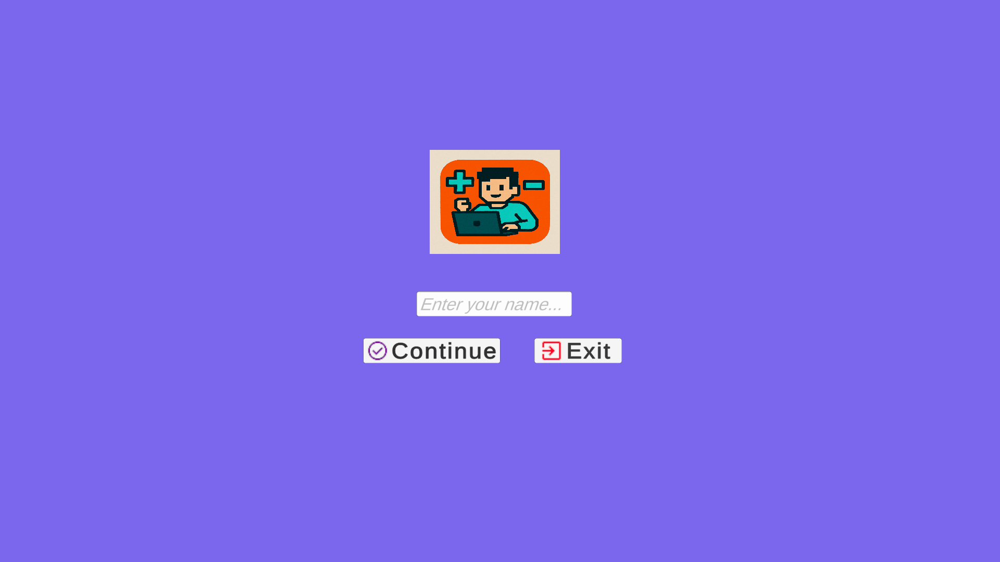
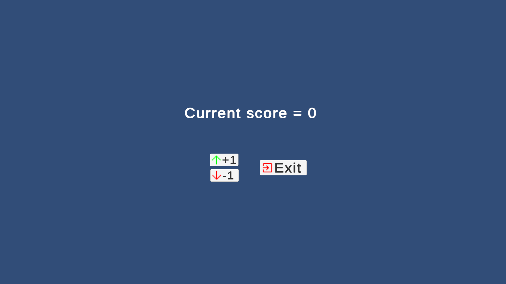

# 🎮 CountingBuddy

A simple and fun 2D Unity app that lets users enter their name, increase or decrease a counter, and get a congratulatory message when they hit 10.

---

## 🧩 Features

- 👤 Personalized name input
- ➕➖ Increment & decrement counter
- 💾 Progress saved using `PlayerPrefs`
- 🎉 Congratulations screen when counter reaches 10
- 🔁 Restart button to reset the app
- 🔄 Multi-scene navigation

---

## 📸 Screenshots

| Welcome Scene | Counter Scene | Congrats Scene |
|---------------|---------------|----------------|
|  |  |  |

---

## 📁 Project Structure
```
Assets/
 ├─ Scenes/
 │   ├─ Welcome.unity
 │   ├─ Counter.unity
 │   └─ Congrats.unity
 ├─ Scripts/
 │   ├─ WelcomeScreenController.cs
 │   ├─ CounterScreenController.cs
 │   ├─ CongratsScreenController.cs
 │   └─ PrefKeys.cs
 └─ UI/Assets (images, fonts, etc.)
```
---

## 🧠 Technologies Used

- Unity 2D UI Toolkit (UGUI)
- C# (MonoBehaviour Scripts)
- PlayerPrefs for persistent storage

